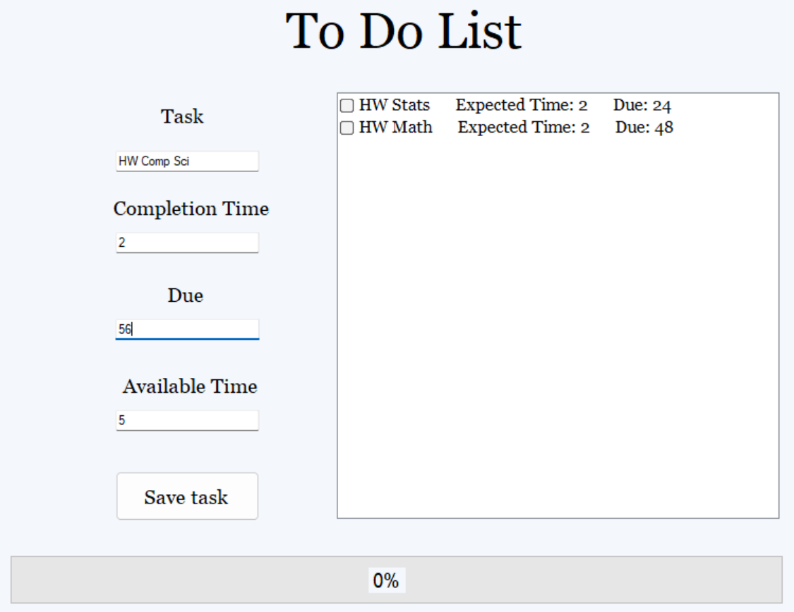
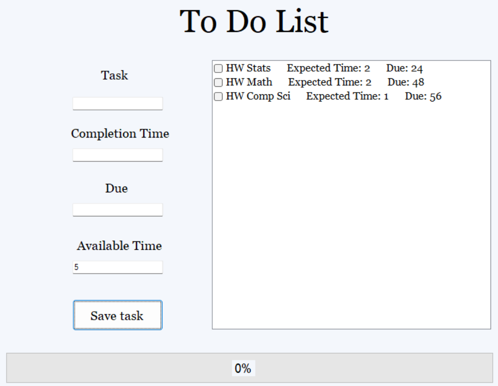
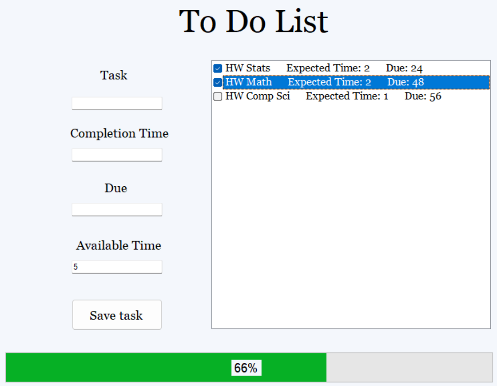
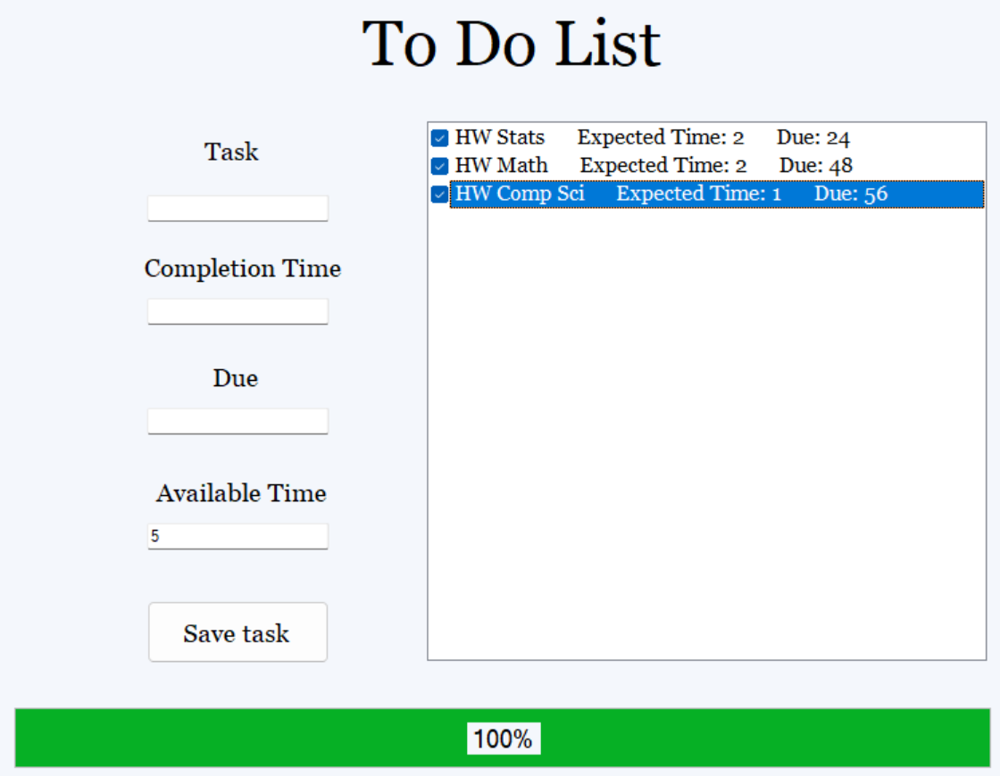

# Task Management GUI

## Overview
This project is a **Graphical User Interface (GUI)** designed to streamline task management. It empowers users to input and organize multiple tasks, prioritize them based on deadlines and available time, and monitor their progress with ease through a visually engaging interface.

## Features
- **Task Input and Organization:** Effortlessly add, edit, and delete tasks while managing them within a specified time frame.
- **Priority Scheduling:** Automatically prioritize tasks based on their deadlines and your availability, ensuring efficient task completion.
- **Dynamic Progress Bar:** Visualize progress in real-time with a dynamically updating progress bar that gamifies the process and boosts productivity.

## Installation
1. Clone the repository:
   ```bash
   git clone https://github.com/your-username/task-manager-gui.git
   ```
2. Open the project in **Visual Studio 2022**.
3. Build the solution to restore dependencies and compile the code:
   - Go to the **Build** menu and select **Build Solution**.
4. Run the application:
   - Press **F5** or navigate to **Debug > Start Debugging**.

## Usage
1. Launch the application.
2. Add tasks by providing their name, deadline, and estimated time.
3. View the dynamically updated task list, prioritized for optimal scheduling.
4. Mark tasks as complete to update the progress bar and track your productivity.

## Screenshots

*Figure 1: Enter a given task.*


*Figure 2: The new task is added, algorithm runs to optimize schedule. Notice that it still recommends spending an hour working on my Computer Science homework.*


*Figure 3: Once a task is completed, the bar and percentage are increased.*


*Figure 4: Once all tasks are complete, the bar fills entirely.*

## Technologies Used
- **C#**: Backend logic and scheduling algorithms.
- **Windows Forms (WinForms):** GUI framework for creating a user-friendly interface.
- **Visual Studio 2022:** Integrated development environment for building and running the application.

## License
This project is licensed under the [MIT License](./LICENSE).

